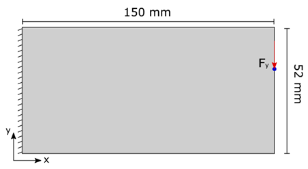

# Topologically-Optimal-Design-and-Failure-Prediction-using-Conditional-Generative-Adversarial-Network


This repository contains the official implementation of the "Topologically Optimal Design and Failure Prediction using Conditional Generative Adversarial Networks"

Demo:

[](https://colab.research.google.com/github/udithhaputhanthri/Topological-Optimal-Design-and-Failure-Prediction-using-Conditional-Generative-Adversarial-Networks/blob/master/TopOpt_demo.ipynb)

This notebook can be used to obtain "Optimal Topology Stress Maps" given the parameters explained below.

# Abstract

Topology optimization is the tool of choice in obtaining the initial design of structural components. The resulting optimal design from topology optimization will be the input for subsequent structural optimizations with regard to shape, size, and layout. In reality, however, iterative solvers used in conventional SIMP (Simplified Isotropic Material with Penalization) based topology optimization schemes consume a very high computational power and therefore act as a bottleneck in the manufacturing process. In this work, an accelerated topology optimization technique based on deep learning is presented. Conditional Generative Adversarial Network (cGAN) architecture is used to predict the optimal topology of a given structure subject to a set of input parameters. Next, stress contours are mapped onto the optimal structure to give accurate stress distribution over the structural domain. The predicted maximum Von-mises stress can directly be compared to the yield strength of the material for failure analysis. This technique is proven to arrive at the optimal design of a structure within a negligible amount of time. Also, this method is capable of predicting the stresses in the optimal design and hence plays a decisive role in the integrity of the optimal structure.

# Problem Definition


Material design domain and applied displacement and loading boundary conditions of a topology optimization problem. Corresponding topologically optimized structure and the Von-Mises stress contours on optimal design

Sample Problem : 


Problem definition at the reference configuration for database construction

To generate the optimal topology structure given the parameters of prescribed volume fraction and location of the applied load, we propose a Convolutional Neural Network + Conditional Generative Adversarial Network-based method.

# Sample Results


Visualization: Optimal Structure (1, 2 blocks: real (top), generated (bottom))


Visualization: Stress Maps (1, 2 blocks: real (top), generated (bottom))


Visualization: Maximum Stress Points (1, 2 blocks: real (top), generated (bottom))


# Citation

Citation for the repository:

```
@software{udith_haputhanthri_2020_4020890,
  author       = {Udith Haputhanthri},
  title        = {{udithhaputhanthri/Topological-Optimal-Design-and- 
                   Failure-Prediction-using-Conditional-Generative-
                   Adversarial-Networks: First release}},
  month        = sep,
  year         = 2020,
  publisher    = {Zenodo},
  version      = {v1.0.0},
  doi          = {10.5281/zenodo.4020890},
  url          = {https://doi.org/10.5281/zenodo.4020890}
}
```
