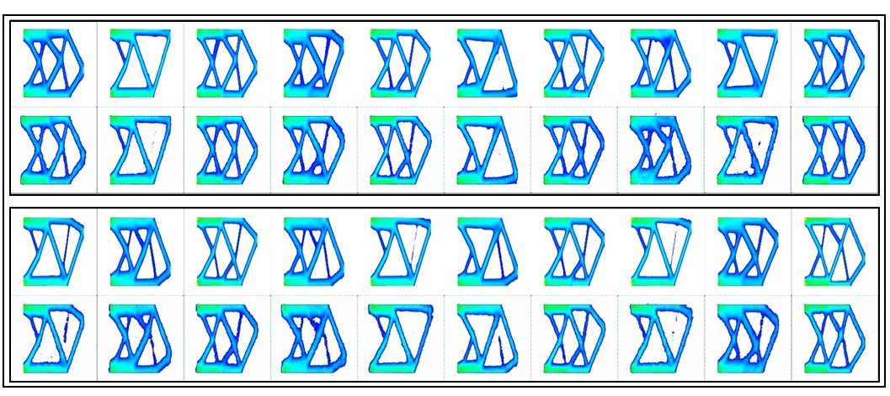

# Topologically-Optimal-Design-and-Failure-Prediction-using-Conditional-Generative-Adversarial-Network

<!---->

This repository contains the official implementation of the "Topologically Optimal Design and Failure Prediction using Conditional Generative Adversarial Networks"

Demo:

[](https://colab.research.google.com/github/udithhaputhanthri/Topological-Optimal-Design-and-Failure-Prediction-using-Conditional-Generative-Adversarial-Networks/blob/master/TopOpt_demo.ipynb)

This notebook can be used to obtain "Optimal Topology Stress Maps" given the parameters explained below.

# Abstract

Among the various structural optimization tools, topology optimization is the widely used technique in obtaining the initial design
of structural components. The resulting topologically optimal initial design will be the input for subsequent structural optimizations
such as shape, size and layout optimizations. However, iterative solvers used in conventional topology optimization schemes are
known to be computationally expensive, thus act as a bottleneck in the manufacturing process. In this paper, a novel deep learning
based accelerated topology optimization technique with the ability to predict ductile material failure is presented. A Conditional
Generative Adversarial Network (cGAN) coupled with a Convolutional Neural Network (CNN) is used to predict the optimal
topology of a given structure subject to a set of input variables. Subsequently, the same cGAN is trained to predict the Von-Mises
stress contours on the optimal structure by means of color transformed image-to-image translations. The ductile failure criterion
is evaluated by comparing the cGAN predicted maximum Von-Mises stress with the yield strength of the material. The proposed
numerical method is proven to arrive at the topologically optimal design, accompanying the material failure decision within a
negligible amount of time but also maintaining a higher prediction accuracy.

# Problem Definition


**Fig :** Material design domain and applied displacement and loading boundary conditions of a topology optimization problem. Corresponding topologically optimized structure and the Von-Mises stress contours on optimal design

Sample Problem : 


**Fig :** Problem definition at the reference configuration for database construction

To generate the optimal topology structure given the parameters of prescribed volume fraction and location of the applied load, we propose a Convolutional Neural Network + Conditional Generative Adversarial Network-based method.

<!---# Sample Results

**Fig :** Visualization: Optimal Structure (1, 2 blocks: real (top), generated (bottom))

**Fig :** Visualization: Stress Maps (1, 2 blocks: real (top), generated (bottom))

**Fig :** Visualization: Maximum Stress Points (1, 2 blocks: real (top), generated (bottom))--->

# Citation

Citation for the repository:

```
@software{udith_haputhanthri_2020_4020890,
  author       = {Udith Haputhanthri},
  title        = {{udithhaputhanthri/Topological-Optimal-Design-and- 
                   Failure-Prediction-using-Conditional-Generative-
                   Adversarial-Networks: First release}},
  month        = sep,
  year         = 2020,
  publisher    = {Zenodo},
  version      = {v1.0.0},
  doi          = {10.5281/zenodo.4020890},
  url          = {https://doi.org/10.5281/zenodo.4020890}
}
```
